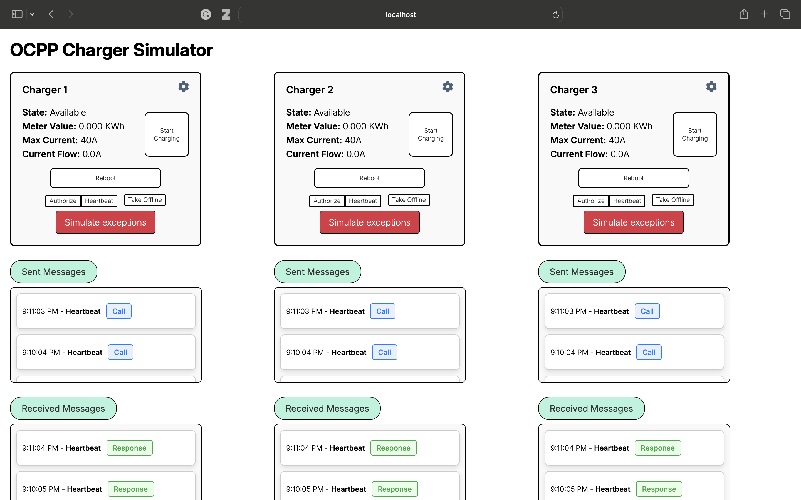
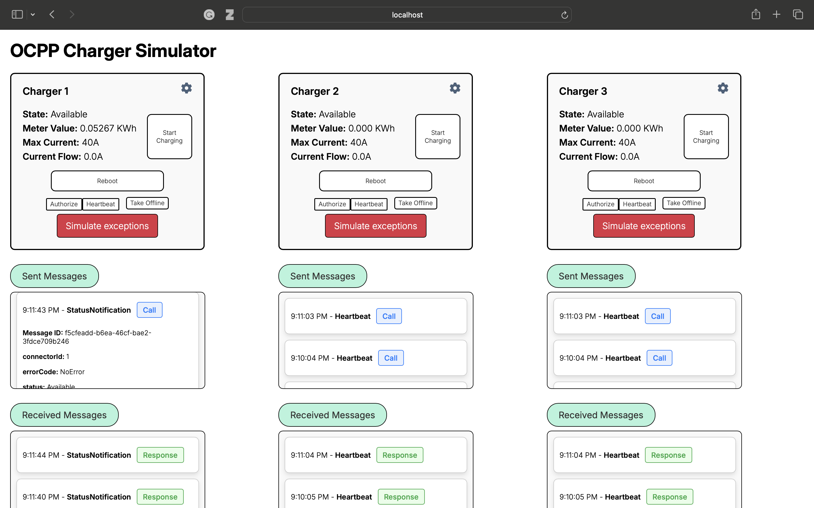
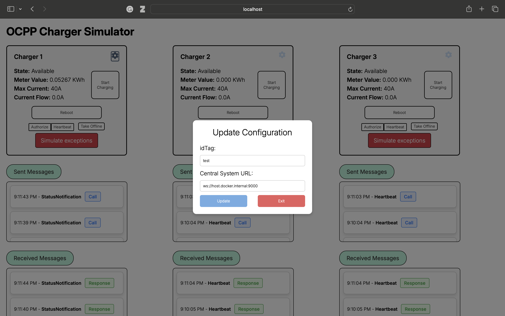
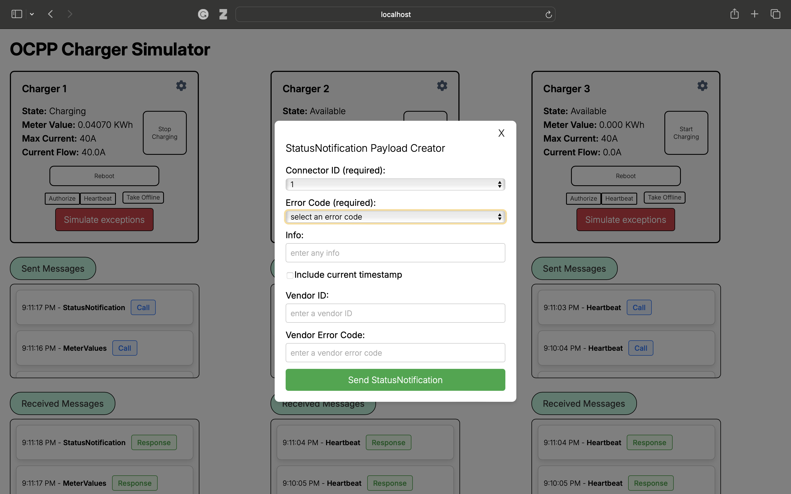
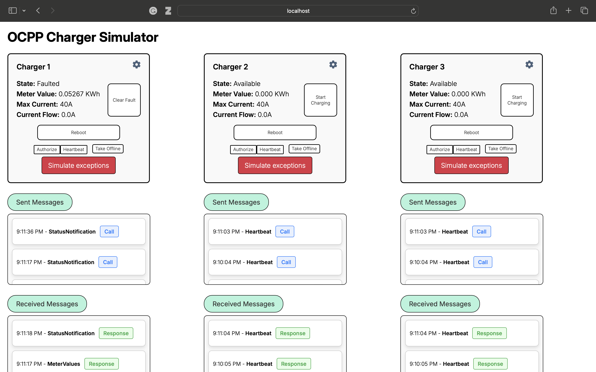

## Terms
**OCPP Protocol**: Open Charge Point Protocol 1.6,
edition 2, Final

**OCPP-J Protocol**: Open Charge Point Protocol JSON 1.6, OCPP-J 1.6 Specification, Final

**Simulator**: The overall application. This contains 3 Chargers.

**Charger**: A single simulated OCPP Charger Point.

**OCPP State**: A state of the simulated Charger that is described in `4.9. Status Notification` of the OCPP Protocol.

**Non-OCPP State**: A state of the simulated Charger that is used internally and does not map to an OCPP state.

## Getting Started
The Simulator can be built and run using the instructions in README.md.

When the Simulator is started, it will attempt to open a WebSocket connection to the provided or default Central System URL. It will append its idTag to the URL. Given an idTag of `abc` and a URL of `ws://central-system`, it will open a connection to `ws://central-system/abc`

By default, the Simulator will use an idTag of `test` and a Central System URL of `ws://host.docker.internal:9000`. This can be updated via the Configuration Menu (shown below under "UI Interaction") or by the command line (shown in README.md under "Loading configuration variables").

## General Notes

After sending a message, a Charger in the Simulator will wait up to 30 seconds for a response before sending another message.

A Charger in the Simulator has a single connector. The `connectorId` field in messages sent to a Charger can be either 1 or 0. They are assumed to be equivalent and will not affect the Charger’s response.

## Booting

 When the Simulator successfully connects to the Central System, the Chargers attempt to send a `BootNotification` message. The Chargers transition from the Non-OCPP State, `PoweredOff`, to the Non-OCPP State, `BootingUp`. At this point, the Chargers are OCPP 1.6 compliant and can respond to supported messages. 
 
 A Charger will remain in the Non-OCPP State, `BootingUp`, until the Central System responds with a `BootNotification` response with an `Accepted` status.

 Upon being accepted, a Charger will transition into the OCPP State, `Available` (or `Unavailable` if the Charger was set to `Unavailable` before a Reboot). The Charger will send a `StatusNotification` message indicating the state change, followed by the first `Heartbeat` message. `Heartbeat` messages will be sent periodically, following the interval set in the `BootNotification` response. 

## UI Interaction

The image above shows the Simulator in a typical state. The Charger frames display the following:
* The Charger's name (1, 2, or 3)
* The Charger's current state (both Non-OCPP and OCPP states)
* The current value of the Charger's meter (this is a cumulative reading of the electrical energy used and corresponds to the `
Energy.Active.Import.Register` measurand.)
* The maximum current the Charger can provide (this value will never be exceeded)
* The instantaneous current being used by the Charger

The Charger frame also has several buttons:
* The "Start Charging" button is a context button that will change according to the state of the Charger
  * This button can start or stop a charging session
  * When charging starts, a Charger sends a `StatusNotification` indicating transition into the `Pending` OCPP state, followed by an `Authorize` message. If the `Authorize` receives an `Accepted` response, it will send a `StartTransaction`, followed by a `MeterValues`, followed by a `StatusNotification` indicating transition into the `Charging` state.
  * When charging stops, a Charger sends a `StatusNotification` indicating transition into the `Available` OCPP state, followed by a `StopTransaction` and a `MeterValues`.
* The "Reboot" button will power off the Charger and boot it back up (see "Booting" in this file)
* The ‘Authorize’ button will send an `Authorize` message on demand, though this does not affect the Charger
* The "Heartbeat" button will send a `Heartbeat` message on demand. This may set the Charger's internal clock.
* The "Take Offline" button will stop the Charger from sending messages and any received messages will be discarded. This will also stop WebSocket Ping Pong messages.
* The "Simulated exceptions" button is described further below.
* The gear icon button is described further below.

The UI also displays the messages that a Charger sends and receives. A timestamp marks the real time the message was sent or received. It also lists the message name and describes if it is a Call (Call), Response (CallResult), or an Error (CallError). As seen below, a logged message can be clicked to view its contents. Clicking a 2nd time will collapse the logged message.

***
\

Clicking the gear icon on a Charger's frame will open its "Update Configuration" menu. This menu allows for modification of the idTag and the Central System URL used by the Charger. A Charger reboot is required to take effect (click the "Reboot" button).

***
\

Clicking the "Simulated exceptions" button will bring up the menu above. The Charger will send a `StatusNotification` message with the desired contents. Any `Error Code` other than `NoError` will put the Charger in an OCPP `Faulted` state.

***
\

When the Charger is in the OCPP `Faulted` state. While faulted, charging is not possible. Clicking the "Clear Fault" button will restore the Charger to the OCPP `Available` state.

## Headless Interaction
The UI communicates with the Simulator via an HTTP API. This API is documented in `documentation/HTTP_API.md`. For automation purposes, this API can be used directly to control the Simulator.

## Supported OCPP States
For more information on specific states, see "4.9. Status Notification" of the OCPP 1.6 Protocol.

| State    
| ------------ |
| Available    |
| Preparing    |
| Charging     |
| Faulted      |
| Unavailable  |

## Supported Operations
For more information on specific operations, see sections 4 and 5 of the OCPP 1.6 Protocol.

| Operation    | Notes   |
| ------------ | ------- |
| Authorize             |         |
| Boot Notification             |         |
| Heartbeat             |         |
| Meter Values             |         |
| Start Transaction             |         |
| Stop Transaction             |         |
| Change Configuration             | Most standard configuration keys are not implemented        |
| Change Availability             |         |
| Get Configuration             |         |
| Remote Start Transaction             |         |
| Remote Stop Transaction             |         |
| Set Charging Profile             | Recurring profiles are not implemented. There is no support for the Clear Charging Profile operations (a reboot is required to reset the stack).       |
| Trigger Message             | DiagnosticsStatusNotification and FirmwareStatusNotification triggers are not implemented       |

## Supported Configurations
For more information on specific configurations, see section 9 of the OCPP 1.6 Protocol.

Our configuration system currently does not support CSL and assumes configurations are single values.

| Configuration            | Notes                                      |
| -------------------------| ------------------------------------------ |
| meterValuesSampledData   | Defaults to "Energy.Active.Import.Register"|
| MeterValueSampleInterval | Defaults to 30                             |