- [1. The Sponsor](#1-the-sponsor)
- [2. What will we be doing?](#2-what-will-we-be-doing)
  - [2.1. Summary](#21-summary)
  - [2.2. Wanted Features](#22-wanted-features)
  - [2.3. Previous Work](#23-previous-work)
  - [2.4. Current Tech](#24-current-tech)
  - [2.5. Related Links](#25-related-links)
- [3. Issues](#3-issues)
  - [3.1. Adding Photo Spheres](#31-adding-photo-spheres)
  - [3.2. Issues with adding or editing hotspots](#32-issues-with-adding-or-editing-hotspots)
  - [3.3. Nested Hotspot Concerns](#33-nested-hotspot-concerns)
  - [3.4. General UI concerns](#34-general-ui-concerns)
  - [3.5. Coherent design](#35-coherent-design)
  - [3.6. Gamification](#36-gamification)
  - [3.7. Iconography](#37-iconography)
  - [3.8. Too many elements.](#38-too-many-elements)
  - [3.9. Editing NavMesh](#39-editing-navmesh)
  - [3.10. Cannot move hotspots after placement](#310-cannot-move-hotspots-after-placement)
  - [3.11. Bugs](#311-bugs)

# 1. The Sponsor

Rick Hugo ([hugo@pdx.edu](mailto:hugo@pdx.edu))  
Rick Hugo, Ph.D.  
Department of Geology, Portland State University  
503-725-3356  

# 2. What will we be doing?

## 2.1. Summary

The project is working on a virtual field enviroment editor and viewer for designing field trips using a Google Street View style viewer. This will be used by Geology capstone students to create a virtual field trip for use in elementary and high school education. This editor allows you to place hotspots to give more information about areas in the photosphere, linked photospheres and other features that would assist in creating a virtual field trip. While a previous team worked on this before, the current editor and viewer suffers from unintuitive UI, and many issues that make working with such a program harder. We will mainly be fixing and modifying the UI to be more intuitive to use and in general reduce friction inside of the editor. 

## 2.2. Wanted Features

1. Develop a more intuitive UIX for the editor. 
2. Create a more better UIX for the viewer, incorporating themes to enable a more friendly user experience
3. Finish the gamification of the project, the previous team has started this but it doesn’t seem complete or accessible.
4. “Recreate a critical feature of Holobuilder - a split view of two 360 panoramas, linked so that a user can view changes in a location over time.” Maybe create a timeline view on the bottom of the screen the user can change to different time periods. 

## 2.3. Previous Work

The previous work on the UIX seems workable but has many issues in terms of usability and accessibility. I feel a lot of the UIX elements are not at all intuitive to use or clear. The current viewer and editor are written in react and are completely serverless in how it runs. It uses a service called vercel to host their website but it does nothing more than justserver the html. To start the editor you must drag and drop a .vfe file (just a renamed zip) that contains the various images, hotspots, and photosphere data.

## 2.4. Current Tech
- React.JS
- Vercel
- [Photo Sphere Viewer](https://photo-sphere-viewer.js.org)

## 2.5. Related Links

- [Current VFE Application](https://virtual-field-environments.vercel.app)
- [Current Source Code](https://github.com/kingsawpdx/virtualFieldEnvironments)
- [Proposal](https://docs.google.com/document/d/1EVQt-meafmD1kn-RcqmmQ_sJXN3WAMge/edit?rtpof=true)
- [Notes](https://docs.google.com/document/d/1ZCQPYToDrPnujKdvv08zzDpyTzMeU_r2OVcmdy9P1c4/edit)
- [Previous Presentation](https://www.youtube.com/watch?v=UG7JK46kwoo)

# 3. Issues

## 3.1. Adding Photo Spheres

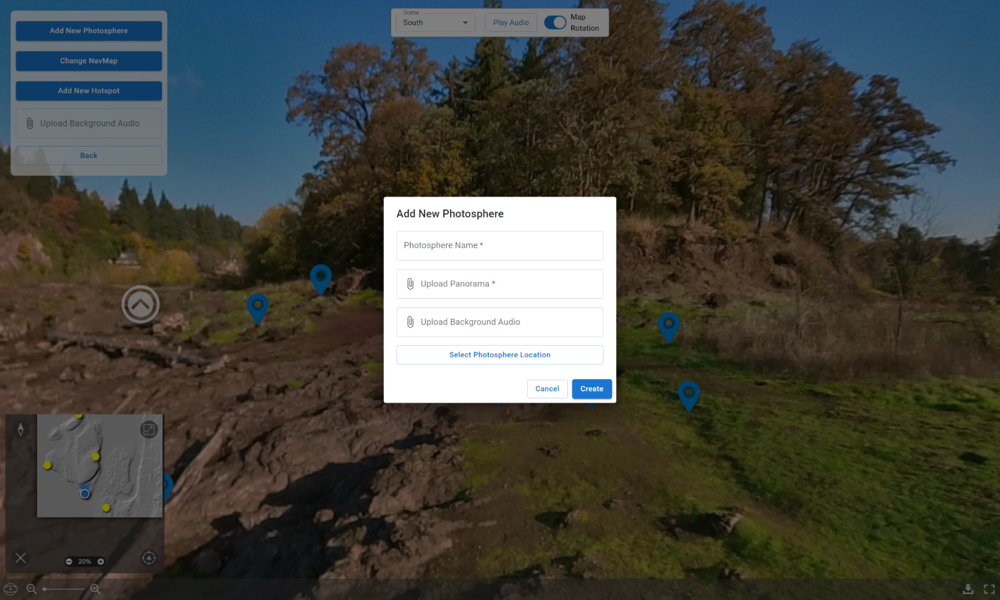  
Adding a new photosphere is shown by a popup, with selecting the location being a separate pop-up. This isn’t very intuitive or nice to use. 

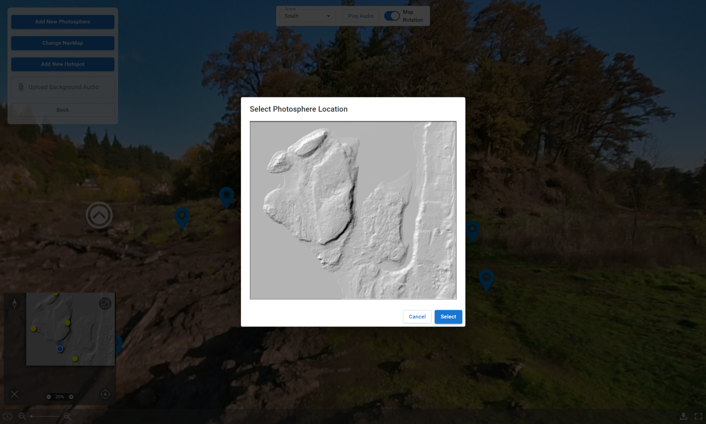  
Not a huge fan of this personally.

## 3.2. Issues with adding or editing hotspots

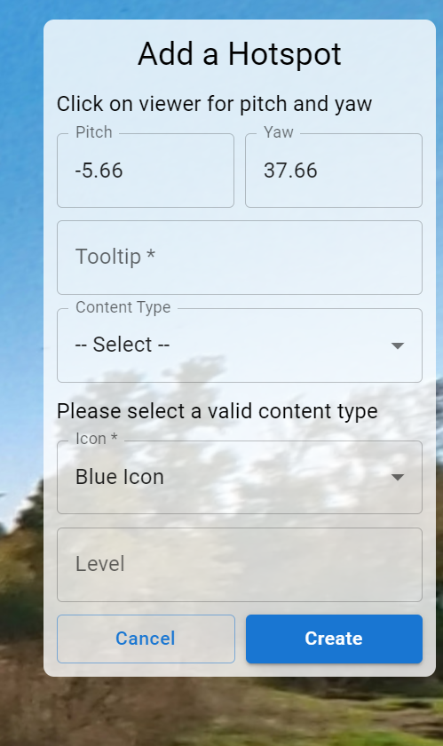  
Adding a hotspot is not that great, while it allows you to click on the viewer to add a hotspot and pick and choose where it is, I feel this is more information than needs to be shown to the user. Having to click an Add Feature button, then an add hotspot button could cause friction in having to add a ton of content to your VFE. 
Also without fully understanding the gamification aspect of the editor, the level field is confusing and unclear in what it does. I feel this UI is very much unneeded as it could just be merged into the normal edit UI and just change how people place hotspots into their photospheres.

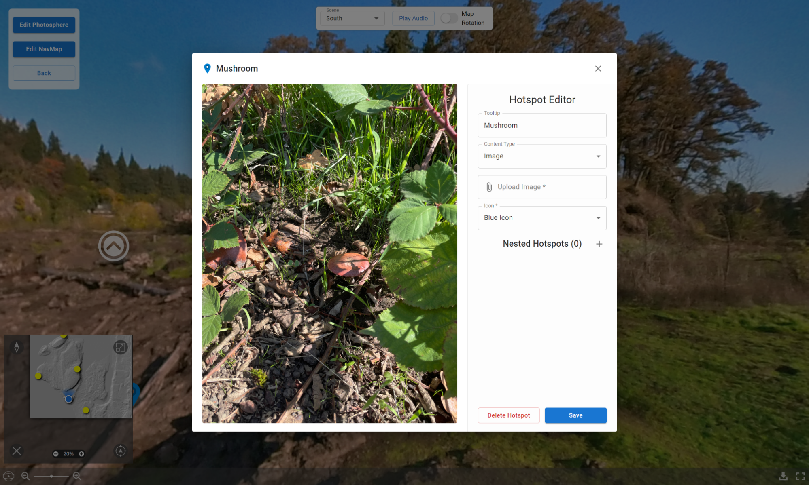  
I understand the choices made here but I’m not a fan of a lot of the decisions here. I don’t like how I can only choose to either have an image, text or any other type. There is no way to have an image and have text to the side to explain it.  I think maybe incorporating some kind of rich text system where you can input links, images or other things inside of a text window. 

## 3.3. Nested Hotspot Concerns

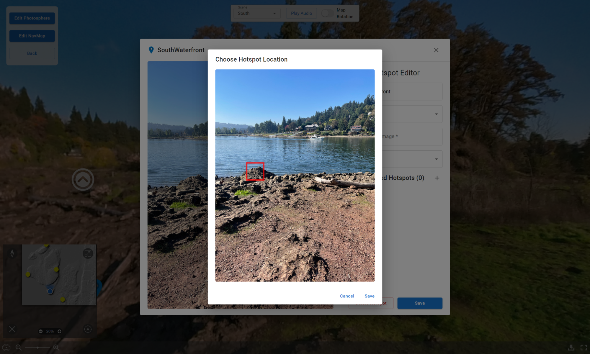  

This UI works for adding nested hot spots but having a separate pop up to decide where to place a hotspot is not at all intuitive and this system prevents you from making a hotspot of any size you wish.

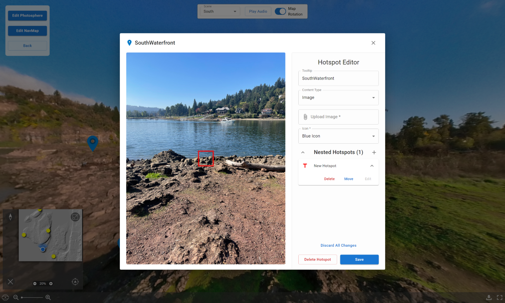  
After adding a nested hotspot there is no way to immediately edit this nested hotspot to add the content you wish. Instead you MUST save and reopen the hotspot to edit the nested hotspot. This causes some friction with working with the editor. 
I would say it’s not clear what these squares are to the user exactly, without me watching the video I may have assumed they were just pointing out details rather than being a clickable portal to another hotspot. Maybe always show the label to help point out that this is an element to be clicked on and not just a picture. 

## 3.4. General UI concerns
  

Having the Map rotation option at the top is not at all intuitive, they described the functionality in the video but it took me a bit to find it due to it’s odd position. On the bottom right of this viewer there is a download button, this does NOT download the current project but instead only downloads the image for the current photosphere. This is not at all intuitive and I’d imagine would only lead to issues and confusion in the future. 

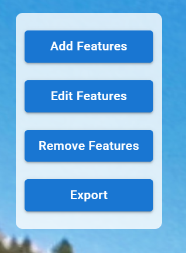  
Instead you must download your project by clicking export here.
One thing I wish was implemented is a way to go into user mode while in the editor. This would allow you to view the VFE in the way a user would without having to exit and open the file in the viewer. 

## 3.5. Coherent design
There is also a lack of coherent UIX design, the photosphere viewer has its own UIX which does not match any of the custom UIX designed for the VFE viewer. They should have matching UIX design and language. 

## 3.6. Gamification
The start of the gamification can be seen in the project but feels very limited in scope, as users can only add one quiz question per photosphere and I don’t see a good way to try and link multiple questions together. 

## 3.7. Iconography

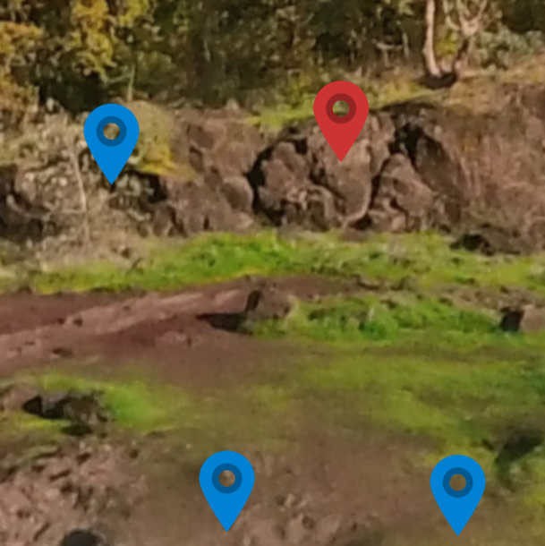  
I don’t enjoy some of the icons shown to the user. The only option to be shown is just generic arrows in two different colors. This does not at all convey to the user what these hotspots contain or if they are important. It would be nice if they related to the content they contain. This would improve the gamification aspect of the project as it’s unclear otherwise which spheres have quizzes you must answer to progress. 

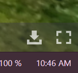  
This icon implies it downloads your project, it does not, it downloads the photosphere image instead.

## 3.8. Too many elements.

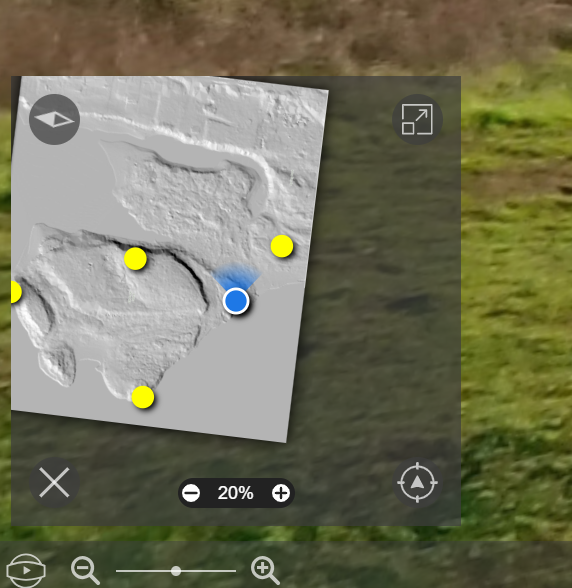  
The amount of elements presented here are not clear to the user, Having two different kinds of zoom is weird to me. Also the button on the bottom left is unclear on what it does (just rotates the photosphere automatically), it feels like a feature of the viewer which should have been removed for the final project.

## 3.9. Editing NavMesh

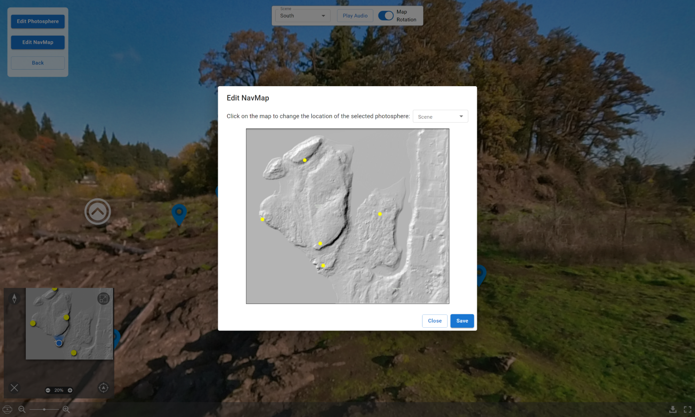  
This UI is not at all intuitive and a lot more clicking than should be required. My brain wants me to just be able to click and move around the dots, but instead moving a dot requires selecting which one you want to change from the dropdown and then clicking on the map. The current dot does NOT light up at all even to let you know which one you’ll be moving so you are forced to just memorize where you put each photosphere. There’s no way to view what each dot is inside of this UI; it just draws dots and gives the user no other information.

## 3.10. Cannot move hotspots after placement
There is no way to move hotspots after placing them, they have to be removed and re-added to move them.

## 3.11. Bugs
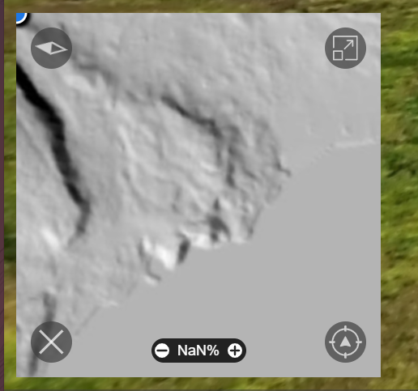  